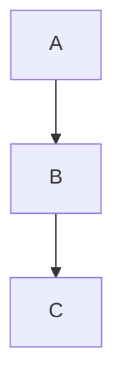

# Sample Report

This is a paragraph with **bold text** and `inline code`.

## Section Two

- item one
- item two
- item three

### Code Example

```python
def hello():
    print("world")
```



---

Some final thoughts on the matter.
More of the same paragraph continues here.

[^3:abcd1234]: This is a general comment -- by:exrhizo
[^18:ef567890]: Another annotation
